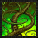

# jQuery Fungus Fighter

Fight mutant fungus villains, with jQuery!

It is you versus the Freaky Fungus, an evil mycological menace from mars. Use your jQuery skills to dispatch attacks against your enemy. To win, the Freaky Fungus must have 0 hit points (HP) before you are out of attack points (AP).

## Requirements

**Handle click events:** 

When you click an attack button:

-  update _state_ variable(s) to make the Freaky Fungus lose hit points (HP), and to reduce your attack points (AP). 
- See [Attacks](#attacks) below, for the AP and HP values of each attack
- State may be held in one our more variables of your choosing
- HP and AP values may not be negative (set to zero, if they would otherwise be negative)

**Render state changes to the DOM**

- Update the text above the attack buttons (eg, "100 AP")
- Update the text above the enemy fungus (eg, "100 HP")
- If the Freaky Fungus runs out of HP, the monster is dead and you win! Replace the `walk` class with a `dead` class on the freaky-fungus element, to make them fall over and die.
- If you run out of AP, the monster wins and humanity is doomed 😢 Replace the `walk` class with a `jump` class on the freaky-fungus element, to make them jump for the glory of the fungal race.
  - You may no longer attack, if AP is `0`. Give all of the attack buttons a [`disabled`](https://www.w3schools.com/tags/att_button_disabled.asp) attribute, so they may no longer be used. 

## Stretch Goals

**Progress Bar**

When state changes:
  - Update the value of each `<progress>` element

> Hint: the jQuery `.val()` method updates the `value` attribute of HTML elements!

**HP Regeneration**

[Scientist have recently revealed](https://www.nature.com/articles/s41598-022-05715-9) that fungi are tougher under harsh conditions.

If the Freaky Fungus' HP falls below 50, have it regenerate 1 HP every second.

> HINT: Look up the built in `setInterval()` function!

## Attacks

###  Arcane Scepter

- **AP Cost:** 12
- **HP Damage:** 14

###  Entangle

- **AP Cost:** 23
- **HP Damage:** 9

###  Dragon Blade

- **AP Cost:** 38
- **HP Damage:** 47

###  Star Fire

- **AP Cost:** 33
- **HP Damage:** 25

## Attributions

Game art is freely available from [OpenGameArt.org](https://opengameart.org/):
- https://opengameart.org/content/animated-mushroom-monster-pixel-art
- https://opengameart.org/content/attack-icons-wesnoth
- https://opengameart.org/content/dark-forest
